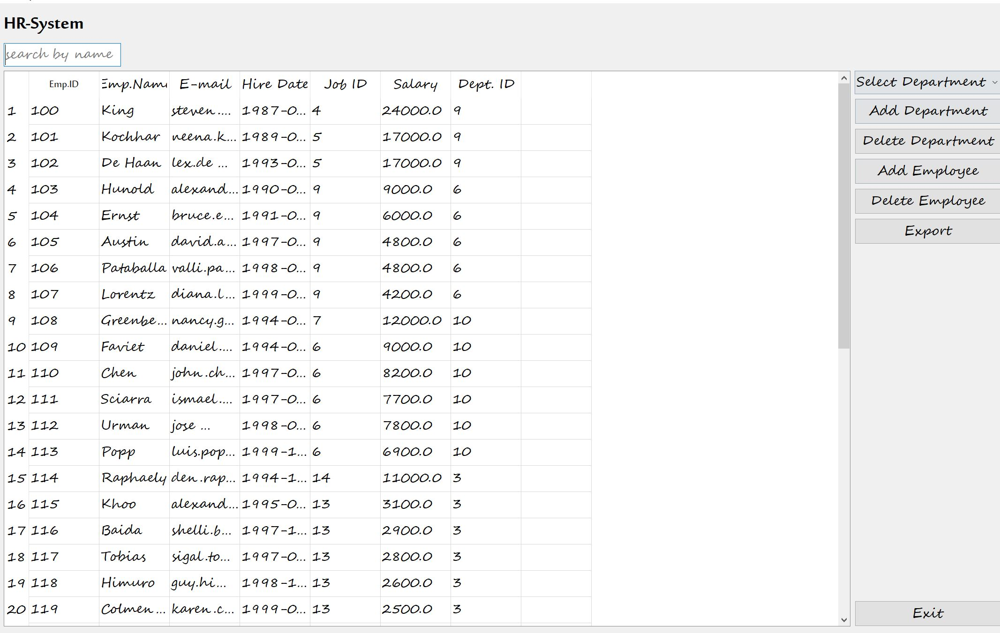

# HR System

## Libraries Used:
    - PyQt5
    - sqlite
## Features:
    1- Search Employees by name 
    2 - Display Employees of Department
    3 - Add and Delete Departments
    4- Add and Delete Employees 
    5- Export Employees data
    
## set up
> Copy the file 'hr.db' to path 'C:\\Users\\admin\\Desktop\\hrdb\\hr.db' 
>then run the main.py 